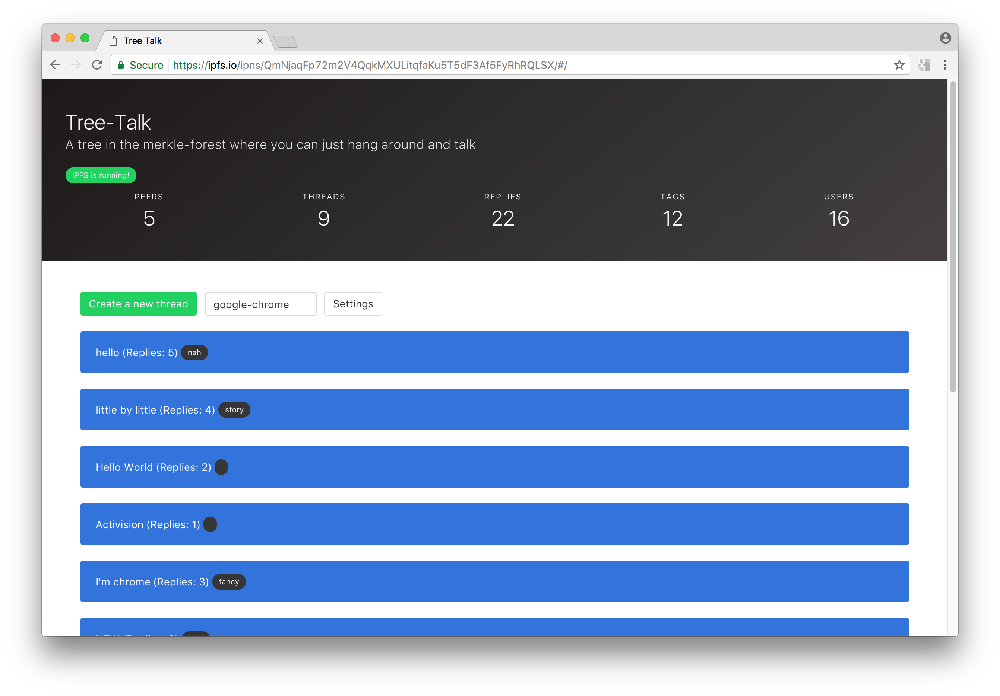

# Tree-Talk
> A tree in the merkle-forest where you can just hang around and talk



## What is this?

Tree-Talk is a forum that works over [IPFS](https://ipfs.io), mainly the pubsub part. There is no
servers involved in sending the threads/posts to other users but there is a
signaling server for helping peers to discover each others.

Tree-Talks data is completely distributed among the peers that are using the
application, with no central storage/database for threads and posts.

## Running

* Official IPFS link: https://ipfs.io/ipfs/QmdsQExVDxp2EgERDZFn2Q7Q6Ldi3uH4XSpQTu4L7aUeTU/#/
* Locally: http://localhost:8080/ipfs/QmdsQExVDxp2EgERDZFn2Q7Q6Ldi3uH4XSpQTu4L7aUeTU/#/

## Installing

**Requirements**

* node
* npm

**Setup**

* `git clone https://github.com/victorbjelkholm/tree-talk`
* `cd tree-talk`
* `npm install`
* `npm start`
* Visit http://localhost:3000

## Publishing your own copy

**Requirements**

* IPFS https://ipfs.io
* IPFS daemon running

**Setup**

Make sure you're running the IPFS daemon somewhere

```
$ ipfs daemon

Initializing daemon...
Swarm listening on /ip4/127.0.0.1/tcp/4001
Swarm listening on /ip4/192.168.1.128/tcp/4001
Swarm listening on /ip4/37.133.29.47/tcp/4001
Swarm listening on /ip6/::1/tcp/4001
API server listening on /ip4/127.0.0.1/tcp/5001
Gateway (readonly) server listening on /ip4/127.0.0.1/tcp/8080
Daemon is ready
```

Then run `npm run publish` to build a production build, add it to IPFS and publish
on IPNS.

You can then visit `https://ipfs.io/ipfs/:hash` or `https://ipfs.io/ipns/:ipnfs-name`

## Architecture

Tree-Talk is using the pubsub and DAG API in js-ipfs to publish and retrieve content.

It publishes resources in a pubsub channel and also listens on the same channel.

There is also a implementation of a caching server who listens to a pubsub channel
and reshares all the content it can find.

## Open Problems

- Spam - Anyone can publish events on a pubsub channel and spam the network
	- Possible Solutions:
		- Every client keeps track of how many threads/posts they received from another
		client and if 2 posts > 1 minute, put the client on cooldown

## Testing

Should include a acceptance testing suite for making sure everything is always
working as it should.

- Start signal server
- Start browser 1
- Start browser 2

Scenarios:
- Browser 1 & 2 are connected, showing "1 peer" each

## License

MIT 2017 - Victor Bjelkholm
